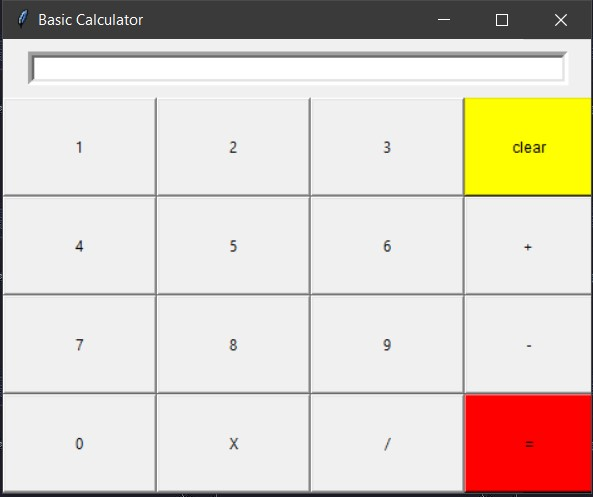

---
# Python Tkinter Calculator

This is a basic calculator application built using Python's Tkinter library. The calculator allows users to perform simple arithmetic operations such as addition, subtraction, multiplication, and division.

## Features

- **Arithmetic Operations:** Addition, subtraction, multiplication, and division.
- **Clear Function:** Clear the input field to start a new calculation.
- **Responsive Interface:** Simple and easy-to-use graphical user interface.

## Prerequisites

- Python 3.x installed on your system.

## How to Use

1. **Clone the Repository:**
   ```bash
   git clone https://github.com/your-username/tkinter-calculator.git
   ```

2. **Run the Application:**
   ```bash
   cd tkinter-calculator
   python calculator.py
   ```

3. **Usage:**
   - Enter numbers by clicking on the respective buttons.
   - Use the operation buttons (+, -, *, /) for arithmetic operations.
   - Press the "Clear" button to reset the input field.
   - Press "=" to display the result of the operation.

## Preview



## Contributors

- [010binary](https://github.com/010binary)

Contributions to enhance the calculator or add new functionalities are welcome! Feel free to fork the repository, make your changes, and submit a pull request.


## Acknowledgements

Thank you to the Tkinter library for providing an easy-to-use interface for creating GUI applications in Python.

Happy Calculating! 🧮✨

---
